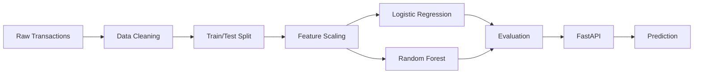
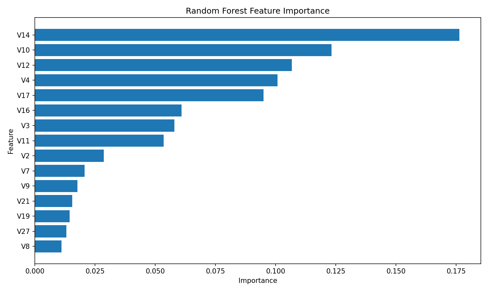

# FraudGuard AI

Machine learning pipeline and REST API for credit card fraud detection.

FraudGuard AI is an end-to-end fraud detection system built on the [Kaggle Credit Card Fraud Detection dataset](https://www.kaggle.com/datasets/mlg-ulb/creditcardfraud). It covers the full ML lifecycle: exploratory analysis, data preparation, feature engineering, model training, threshold analysis, feature importance reporting, and a FastAPI inference service that serves predictions in real time.

Fraud detection on real-world transaction data is a challenging problem. Fraudulent transactions are rare—they represent roughly 0.17% of all records in this dataset—which creates a severe class imbalance that standard accuracy metrics do not capture. The project addresses this with stratified splits, class-weighted models, and evaluation metrics (PR-AUC, F1, confusion matrix) that are meaningful under imbalance.

---

## Table of Contents

- [Overview](#overview)
- [Key Features](#key-features)
- [Architecture](#architecture)
- [Dataset](#dataset)
- [Data Preprocessing](#data-preprocessing)
- [Model Development](#model-development)
- [Model Evaluation](#model-evaluation)
- [Threshold Analysis](#threshold-analysis)
- [Feature Importance](#feature-importance)
- [REST API](#rest-api)
- [API Request Example](#api-request-example)
- [API Response Example](#api-response-example)
- [Running Locally](#running-locally)
- [Testing](#testing)
- [Project Structure](#project-structure)
- [Limitations](#limitations)
- [Future Improvements](#future-improvements)
- [Tech Stack](#tech-stack)
- [Project Status](#project-status)

---

## Overview

The system trains two classification models—a Logistic Regression baseline and a Random Forest—on preprocessed transaction data, evaluates them across precision, recall, F1, ROC-AUC, and PR-AUC, and exposes the Random Forest model through a FastAPI service. The API accepts a raw transaction record, applies the same scaling used during training, runs inference, and returns a fraud probability, a binary prediction, and a categorical risk level.

---

## Key Features

- Binary fraud classification on real credit card transaction data
- Stratified train/test split to preserve class distribution under severe imbalance
- StandardScaler fitted exclusively on training data and reused at inference time
- Logistic Regression baseline for interpretable comparison
- Random Forest with `class_weight="balanced"` to handle class imbalance
- Threshold analysis to explore precision/recall trade-offs at different operating points
- Feature importance report with per-feature contribution scores
- FastAPI inference service with Pydantic input validation
- Three-tier risk classification: LOW, MEDIUM, HIGH
- Automated API tests covering health, normal transaction, and fraud transaction paths

---

## Architecture

### Training Pipeline



### Inference Flow

```
Client Request
    -> FastAPI endpoint
    -> Pydantic validation
    -> DataFrame construction
    -> Scale Time + Amount (saved scaler)
    -> Random Forest predict_proba
    -> Fraud probability
    -> Threshold comparison (default: 0.50)
    -> Risk level assignment
    -> JSON response
```

---

## Dataset

| Metric | Value |
|---|---:|
| Original transactions | 284,807 |
| Fraud transactions | 492 |
| Normal transactions | 284,315 |
| Duplicate rows removed | 1,081 |
| Final transactions | 283,726 |
| Input features | 30 |
| Train samples | 226,980 |
| Test samples | 56,746 |
| Train fraud cases | 378 |
| Test fraud cases | 95 |

Class imbalance ratio in the training set is approximately 599:1 (normal:fraud).

The dataset is available from [Kaggle](https://www.kaggle.com/datasets/mlg-ulb/creditcardfraud). It is not included in this repository. Place `creditcard.csv` in `data/` before running the pipeline.

---

## Data Preprocessing

The preprocessing pipeline is implemented in `src/data_preparation.py` and `src/feature_engineering.py`.

**Deduplication.** 1,081 duplicate rows are removed from the raw dataset before any splitting or scaling.

**Train/test split.** An 80/20 stratified split is applied so that both partitions reflect the original class distribution. Stratification is essential here because fraud cases are so rare that a random split could produce a test set with very few or no fraud examples.

**Feature scaling.** The `Time` and `Amount` columns are standardized using `sklearn.preprocessing.StandardScaler`. The scaler is fitted only on the training data (`fit_transform` on `X_train`) and then applied without re-fitting to the test data and at API inference time (`transform` only). Fitting on the full dataset before splitting would constitute data leakage—the model would have seen statistical properties of the test set during training.

**V1–V28.** These features are the result of a PCA transformation applied by the dataset authors. They arrive already scaled and anonymized. No additional transformation is applied to them.

**Scaler persistence.** The fitted scaler is saved to `models/feature_scaler.joblib` and loaded by the API at startup, ensuring training and inference use identical transformations.

---

## Model Development

### Logistic Regression Baseline

`src/train_model.py` trains a Logistic Regression classifier as the baseline. It provides an interpretable reference point and establishes whether a linear decision boundary is sufficient to separate the classes. The baseline is evaluated with the same metrics as the Random Forest to enable direct comparison.

### Random Forest

`src/train_random_forest.py` trains a Random Forest with the following configuration:

```python
RandomForestClassifier(
    n_estimators=200,
    class_weight="balanced",
    max_features="sqrt",
    random_state=42,
    n_jobs=-1,
)
```

- `n_estimators=200`: 200 decision trees are aggregated to reduce variance.
- `class_weight="balanced"`: sample weights are inversely proportional to class frequency, compensating for the 599:1 class imbalance without requiring oversampling.
- `max_features="sqrt"`: each split considers the square root of the total feature count, reducing correlation between trees.
- `random_state=42`: fixed seed for reproducibility.
- `n_jobs=-1`: training uses all available CPU cores.

---

## Model Evaluation

### Comparison Table

| Metric | Logistic Regression | Random Forest |
|---|---:|---:|
| Precision | 0.0564 | 0.9714 |
| Recall | 0.8737 | 0.7158 |
| F1-score | 0.1060 | 0.8242 |
| ROC-AUC | 0.9657 | 0.9445 |
| PR-AUC | 0.6738 | 0.8081 |

Neither model is universally superior. The two models represent different points on the precision/recall curve.

The Logistic Regression achieves high recall (0.8737)—it flags most fraud cases—but very low precision (0.0564), meaning the majority of its fraud alerts are false positives. In an operational setting this would generate a large number of unnecessary transaction reviews or declines.

The Random Forest achieves high precision (0.9714)—nearly all of its fraud alerts correspond to actual fraud—but lower recall (0.7158), meaning it misses roughly 28% of fraudulent transactions. The better PR-AUC (0.8081 vs 0.6738) indicates stronger overall performance across threshold settings.

The appropriate choice depends on the cost structure of the deployment context: the cost of a missed fraud case versus the cost of a false alarm.

### Random Forest Confusion Matrix

| | Predicted Normal | Predicted Fraud |
|---|---:|---:|
| Actual Normal | 56,649 | 2 |
| Actual Fraud | 27 | 68 |

- **True Negatives (56,649):** legitimate transactions correctly classified as normal.
- **False Positives (2):** legitimate transactions incorrectly flagged as fraud.
- **False Negatives (27):** fraudulent transactions that were not detected.
- **True Positives (68):** fraudulent transactions correctly identified.

---

## Threshold Analysis

`src/random_forest_threshold_analysis.py` evaluates the Random Forest across a range of classification thresholds. The default threshold used by the API is **0.50**: a transaction is classified as fraud if `predict_proba` returns a probability >= 0.50.

The API assigns a categorical risk level based on the raw probability regardless of the threshold:

| Risk Level | Condition |
|---|---|
| LOW | probability < 0.30 |
| MEDIUM | 0.30 <= probability < 0.70 |
| HIGH | probability >= 0.70 |

The default threshold of 0.50 is not universally optimal. In fraud detection, the consequences of a false negative (a missed fraud) and a false positive (a blocked legitimate transaction) carry different costs that vary by institution and product. Threshold selection should be driven by a cost-benefit analysis specific to the operational context. The threshold analysis report at `reports/random_forest_threshold_analysis.csv` provides precision, recall, and F1 across thresholds to support that decision.

---

## Feature Importance

`src/feature_importance.py` extracts mean decrease in impurity (MDI) importance scores from the trained Random Forest. The top five features by importance score are:

| Rank | Feature | Importance Score |
|---:|---|---:|
| 1 | V14 | 0.1764 |
| 2 | V10 | 0.1232 |
| 3 | V12 | 0.1067 |
| 4 | V4 | 0.1009 |
| 5 | V17 | 0.0950 |



Feature importance scores reflect each feature's contribution to reducing impurity within the trained Random Forest. Because V1–V28 are anonymized PCA components, their original meaning is not interpretable. Additionally, MDI importance is a model-level measure of predictive contribution and does not establish that any feature causally produces fraud.

---

## REST API

The inference API is implemented with FastAPI and documented via automatic OpenAPI/Swagger at `http://127.0.0.1:8000/docs`.

| Method | Endpoint | Description |
|---|---|---|
| GET | `/health` | Returns API health status and active model name |
| POST | `/predict` | Accepts a transaction record and returns fraud risk prediction |

---

## API Request Example

The request body must include all 30 input features. Values below are the verified normal transaction from `tests/test_api.py`.

```json
{
  "Time": 0.0,
  "V1": -1.3598071336738,
  "V2": -0.0727811733098497,
  "V3": 2.53634673796914,
  "V4": 1.37815522427443,
  "V5": -0.338320769942518,
  "V6": 0.462387777762292,
  "V7": 0.239598554061257,
  "V8": 0.0986979012610507,
  "V9": 0.363786969611213,
  "V10": 0.0907941719789316,
  "V11": -0.551599533260813,
  "V12": -0.617800855762348,
  "V13": -0.991389847235408,
  "V14": -0.311169353699879,
  "V15": 1.46817697209427,
  "V16": -0.470400525259478,
  "V17": 0.207971241929242,
  "V18": 0.0257905801985591,
  "V19": 0.403992960255733,
  "V20": 0.251412098239705,
  "V21": -0.018306777944153,
  "V22": 0.277837575558899,
  "V23": -0.110473910188767,
  "V24": 0.0669280749146731,
  "V25": 0.128539358273528,
  "V26": -0.189114843888824,
  "V27": 0.133558376740387,
  "V28": -0.021053053453453,
  "Amount": 149.62
}
```

```bash
curl -X POST http://127.0.0.1:8000/predict \
  -H "Content-Type: application/json" \
  -d @transaction.json
```

---

## API Response Example

```json
{
  "fraud_probability": 0.555,
  "prediction": 1,
  "is_fraud": true,
  "risk_level": "MEDIUM",
  "threshold": 0.5
}
```

| Field | Type | Description |
|---|---|---|
| `fraud_probability` | float | Raw probability output from the Random Forest (0.0–1.0) |
| `prediction` | int | Binary classification result: 0 = normal, 1 = fraud |
| `is_fraud` | bool | Boolean representation of `prediction` |
| `risk_level` | string | Categorical risk tier: LOW, MEDIUM, or HIGH |
| `threshold` | float | Classification threshold applied to produce `prediction` |

---

## Running Locally

### Prerequisites

There is no `requirements.txt` in this repository. Install the following packages into a virtual environment before running any scripts:

```
pandas
numpy
scikit-learn
joblib
fastapi
uvicorn
pydantic
pytest
matplotlib
```

### Setup

```bash
git clone https://github.com/RahilAlam929/fraudguard-ai.git
cd fraudguard-ai
python -m venv .venv
source .venv/bin/activate        # Windows: .venv\Scripts\activate
pip install pandas numpy scikit-learn joblib fastapi uvicorn pydantic pytest matplotlib
```

### Prepare data

Download `creditcard.csv` from [Kaggle](https://www.kaggle.com/datasets/mlg-ulb/creditcardfraud) and place it in `data/`.

```bash
python src/data_preparation.py
```

### Run the training pipeline

```bash
python src/train_model.py
python src/train_random_forest.py
python src/evaluate_model.py
python src/evaluate_random_forest.py
python src/compare_models.py
python src/feature_importance.py
```

### Start the API

```bash
uvicorn src.api.main:app --reload
```

The API will be available at `http://127.0.0.1:8000`.

Interactive documentation (Swagger UI) is at `http://127.0.0.1:8000/docs`.

---

## Testing

The test suite uses `pytest` and requires the API server to be running on `http://127.0.0.1:8000`.

```bash
pytest tests/test_api.py -v
```

Current result: **3 passed**

Tests cover:
- `test_health` — verifies the health endpoint returns status `healthy` and model name `random_forest`
- `test_normal_transaction` — verifies a known normal transaction is classified with `prediction=0`, `is_fraud=false`, `risk_level=LOW`
- `test_fraud_transaction` — verifies a known fraud transaction is classified with `prediction=1`, `is_fraud=true`

---

## Project Structure

```
fraudguard-ai/
├── data/
│   ├── creditcard.csv          # Source dataset (not committed)
│   └── processed/              # Train/test splits generated by data_preparation.py
├── models/
│   ├── logistic_regression.joblib
│   ├── random_forest.joblib
│   └── feature_scaler.joblib
├── reports/
│   ├── model_comparison.csv
│   ├── model_evaluation.csv
│   ├── random_forest_evaluation.csv
│   ├── random_forest_threshold_analysis.csv
│   ├── feature_importance.csv
│   ├── feature_importance.png
│   ├── class_distribution.png
│   ├── feature_statistics.csv
│   └── phase3_summary.csv
├── src/
│   ├── eda.py
│   ├── data_preparation.py
│   ├── feature_engineering.py
│   ├── train_model.py
│   ├── evaluate_model.py
│   ├── threshold_analysis.py
│   ├── train_random_forest.py
│   ├── evaluate_random_forest.py
│   ├── compare_models.py
│   ├── random_forest_threshold_analysis.py
│   ├── feature_importance.py
│   └── api/
│       ├── __init__.py
│       └── main.py
└── tests/
    └── test_api.py
```

---

## Limitations

- The dataset is highly imbalanced (0.17% fraud). Evaluation metrics that assume balanced classes—such as raw accuracy—are misleading here.
- V1–V28 are anonymized PCA components. Their original meaning is not available, which limits domain interpretation and manual feature analysis.
- Model performance reflects the specific dataset distribution. Generalization to different card networks, geographies, or time periods has not been tested.
- The classification threshold (default 0.50) is not tuned to a specific business cost structure and should not be used in production without explicit calibration.
- The API has no authentication, authorization, or rate limiting. It is not suitable for public-facing deployment without additional hardening.
- There is no real-time transaction ingestion pipeline, streaming infrastructure, or batch scoring system.
- The models have not undergone validation procedures required for deployment in regulated financial environments.

---

## Future Improvements

- Model probability calibration (Platt scaling or isotonic regression) to produce well-calibrated confidence scores
- Cost-sensitive threshold optimization using domain-specific false-positive and false-negative costs
- Additional model families (XGBoost, LightGBM, neural networks) with systematic hyperparameter search
- Explainability tooling (SHAP values) for per-prediction feature attribution
- Model monitoring and alerting for performance degradation in production
- Data drift detection to identify distributional shift in incoming transactions
- API authentication and rate limiting
- Dockerization and container image publishing
- CI/CD pipeline with automated model evaluation gates
- Cloud deployment (e.g., AWS SageMaker, ECS, or Lambda)
- Real-time transaction streaming pipeline (e.g., Kafka, Kinesis)

---

## Tech Stack

| Library | Purpose |
|---|---|
| Python | Core language |
| Pandas | Data loading, manipulation, and CSV I/O |
| NumPy | Numerical operations |
| Scikit-learn | Model training, preprocessing, and evaluation |
| Joblib | Model and scaler serialization |
| FastAPI | REST API framework |
| Uvicorn | ASGI server |
| Pydantic | Request validation |
| Pytest | Automated testing |
| Matplotlib | Feature importance visualization |

---

## Project Status

| Component | Status |
|---|---|
| Core ML pipeline | Complete |
| Model evaluation and reporting | Complete |
| FastAPI inference API | Complete |
| Automated API tests | Complete |
| Docker / containerization | Not implemented |
| CI/CD | Not implemented |
| Production deployment | Not implemented |
